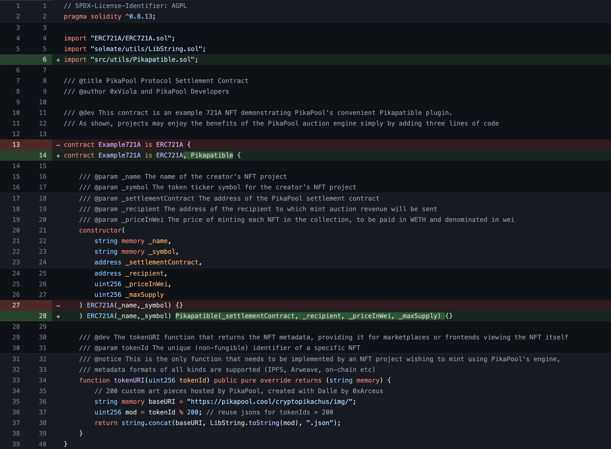

Conducting an NFT sale that **maximises revenue for creators** and **provides the best experience for bidders** is a non-trivial, difficult problem requiring weeks of game theory research and engineering resources...Is what was the case prior to the launch of Pikapool! ⚡

Pikapool can be integrated into a project in **three easy steps** and just a few lines of code.

## Step 1 - Introduce yourself

Introduce yourself in [our Discord server](https://discord.gg/J6ypfSe5GW) where our team will take note of your requirements and provide end-to-end support for your sale.

## Step 2 - Become Pikapatible

An NFT contract can be made compatible with Pikapool with just a few trivial code changes.



Reference: [Example721.sol](https://github.com/0xPikapool/contracts/blob/master/src/Example721A.sol).

## Step 3 - Drop Pikapool into your front-end

Add creation, signing, and submission of Pikapool bids to your front-end with a React Hook, or a few lines of vanilla JS/TS using the [Pikapool TypeScript SDK](https://github.com/0xPikapool/typescript-sdk).

### React Hook

```typescript
import { bids } from "@pikapool/sdk";

function BidComponent() {
  const { 
    signAndSubmit,  // () => Promise<void>;
    isLoading,      // boolean;
    error,          // Error | null;
    receipt,        // BidReceipt | null;
    reset,          // () => void;
  } = bids.hooks.useBid(
    auctionName,    // Auction name
    auctionAddress, // Auction address (aka nft address)
    basePrice,      // Auction base price (per-nft)
    amount,         // Number of NFTs the user wishes to purchase
    tip,            // Amount user wishes to tip (per-nft)
    signer,         // An ethers.js JsonRpcSigner or Wallet
    optionOverrides // PikapoolOptionOverrides
  );
  // your logic...
}
```

Check out our [Pikapool React Demo](https://github.com/0xPikapool/react-demo) for an end-to-end example integration.

### Vanilla JS/TS

```typescript
import { bids } from "@pikapool/sdk";

function createAndSubmitBid() {
  // your logic...
  const typedData: TypedBidData = await createTypedData(
    auctionName,    // Auction name
    auctionAddress, // Auction address (aka nft address)
    basePrice,      // Auction base price (per-nft)
    amount,         // Number of NFTs the user wishes to purchase
    tip,            // Amount user wishes to tip (per-nft)
    bidder,         // Bidder address
    optionOverrides // PikapoolOptionOverrides
  );

  // Sign typedData in any EIP712-compliant way.
  // Example here using an ethers.js JsonRpcSigner.
  const sig: string = await signer._signTypedData(
    typedData.domain,
    typedData.types,
    typedData.message
  );

  const res: SubmitBidResponse = await submitBid(
  typedBidData,    // TypedBidData,
  signature,       // string
  optionOverrides, // PikapoolOptionOverrides
  );
  // your logic...
}
```
